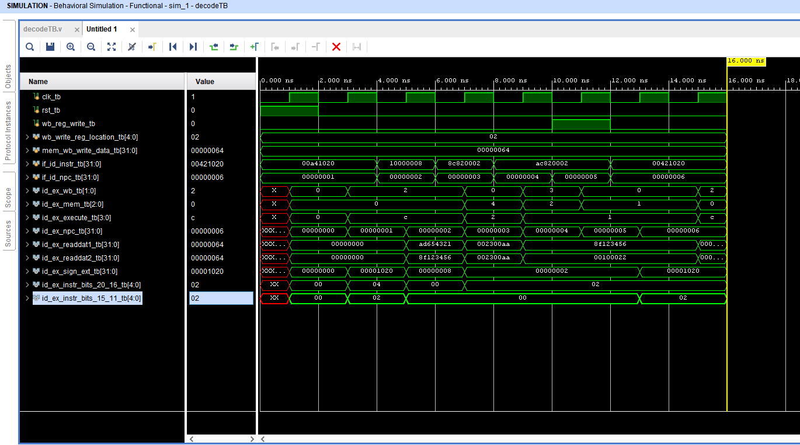

# A2_Decoder_ECE4300

Sources: control.v, idExLatch.v, signExt.v, regfile.v, Decoder.v
 
Simulation: DecoderTB.v
   

control.v: This segment  
idExLatch.v:  
signExt.v:  
regfile.v: register file that stores 32 bits in MIPS  
Decoder.v: The main decoder for the whole code that handles the main outputs for the process.  
 
Decoder: Testbench file 
  

Below is the final timing diagram that shows the decoder in action.
  

